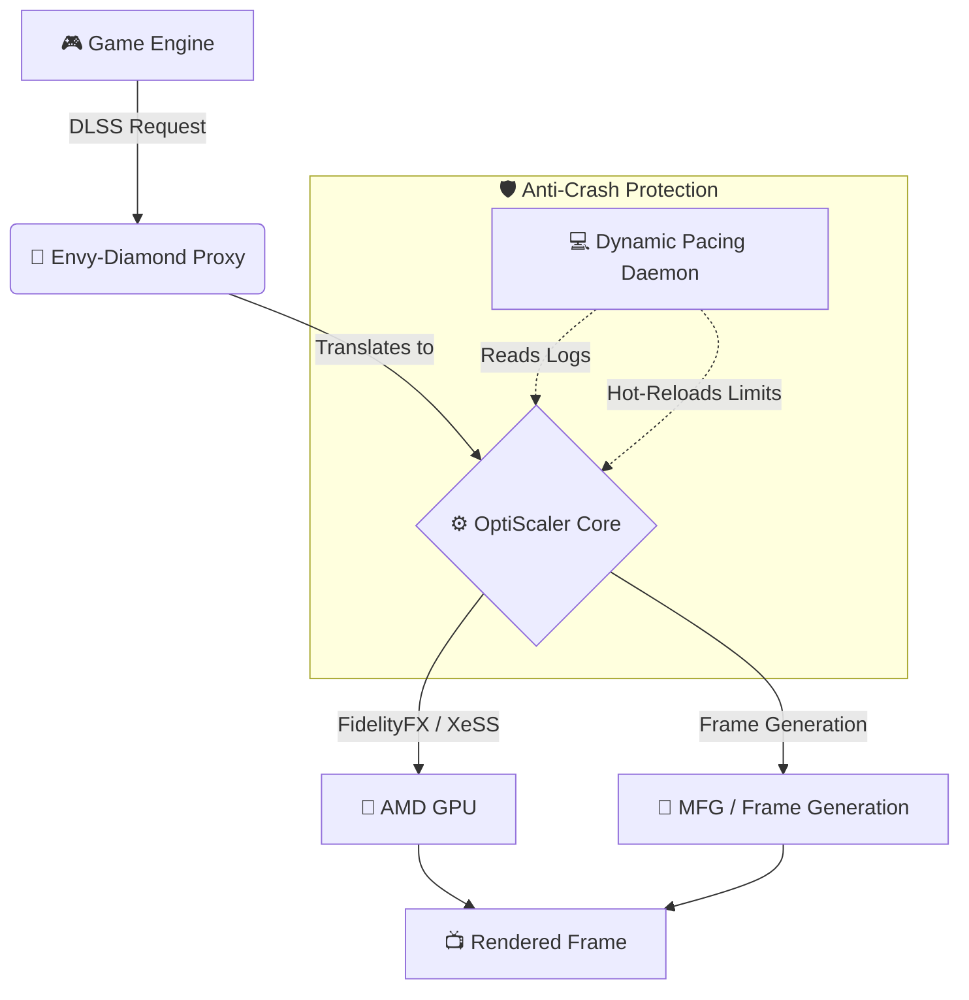

# 💎 Envy-Diamond 💎

**Advanced Neural Rendering & Frame Generation Translation Layer for AMD GPUs**

Envy-Diamond unlocks the true power of DLSS and OptiScaler features on AMD hardware, injecting a custom proxy to translate calls and deliver massive framerate uplifts!

---

## 📋 Table of Contents
- [✨ Features](#-features)
- [⚙️ How it Works](#️-how-it-works)
- [📥 Installation](#-installation)
- [🚀 Launching with Dynamic Pacing (NEW)](#-launching-with-dynamic-pacing-new)
- [⚠️ Disclaimer](#️-disclaimer)

---

## ✨ Features

* 🔴 **AMD Neural Rendering Support:** Experience high-end upscaling paths natively adapted for AMD architecture via HIP.
* 🤖 **NEW! Dynamic Pacing Daemon:** A smart, closed-loop background controller that reads telemetry in real-time. If it detects GPU saturation (100% usage / driver spikes), it dynamically throttles the FPS limit by 8% to prevent AMD TDR timeouts and crashes. When stability returns, it climbs back up!
* 🛠️ **Unreal Engine 5 Hardened:** Includes automatic resource barrier fixes (`ColorResourceBarrier=4`, `MotionVectorResourceBarrier=8`) to prevent memory access violations and colorful artifacting in UE games.
* ⚡ **Multipass Optimization:** Efficient HIP worker publication following actual D3D12 `ExecuteCommandLists`, reducing capture wait times drastically.
* 🎭 **Proxy Spoofing:** Automatic injection bypassing vendor locks.

---

## ⚙️ How it Works

---

## 📥 Installation

> [!WARNING]  
> **To comply with GitHub's file size limits and Terms of Service, proprietary binaries (.dll/.bin) are NOT included in the source code.** 

1. Go to the **[Releases](https://github.com/mnector/Envy-Diamond/releases)** tab and download the latest `Envy-Diamond-Release.zip`.
2. Extract the contents into an empty folder on your desktop.
3. Make sure your game is completely closed.
4. Run `Setup.bat`.
5. Browse for your game's executable (`.exe`).
6. Click **Install**. 

> [!TIP]
> **Spider-Man Remastered Players:** Add `-forceReflexMarkers` to your Steam launch options to enable the Streamline path without breaking ray-tracing!

---

## 🚀 Launching with Dynamic Pacing (NEW)

Instead of launching the game through Steam, go to your game's folder and double-click **`Launch-Envy.bat`**.

This batch file will:
1. Start the **Dynamic Pacing Daemon** in a separate window.
2. Monitor your game's GPU times in real-time.
3. Automatically hot-patch your `.ini` to drop the FPS limit dynamically if your AMD driver is about to crash or timeout, ensuring a **buttery smooth, uninterrupted experience!**

Once you are done playing, simply close the daemon window.

---

## ⚠️ Disclaimer

> [!CAUTION]
> This project modifies game binaries in memory and bypasses vendor checks. **Use at your own risk in single-player games only.** Do not use in multiplayer games with anti-cheat software, as it will likely result in an account ban.

---

*If this mod saved your framerate, consider buying me a coffee to support future development!*

