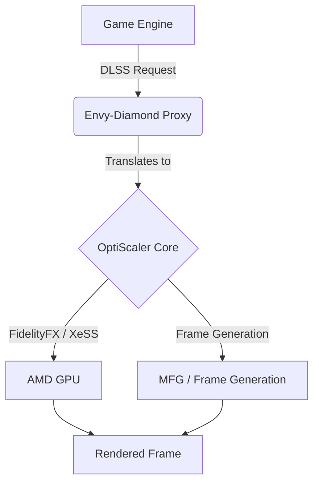

# Envy-Diamond 💎

Envy-Diamond is an advanced translation layer and neural rendering tool designed to enable DLSS features and OptiScaler frame generation on AMD GPUs, providing a massive performance uplift for supported titles.

## Table of Contents
- [Features](#features)
- [How it Works](#how-it-works)
- [Installation](#installation)
- [Configuration](#configuration)
- [Disclaimer](#disclaimer)

## Features
- **Neural Rendering Support**: Enables advanced upscaling paths on AMD hardware.
- **Multipass Optimization**: Efficient HIP worker publication that correctly follows D3D12 `ExecuteCommandLists`, reducing capture waiting times.
- **Proxy Spoofing**: Automatic `dxgi.dll` or `version.dll` injection to bypass vendor locks.

## How it Works

## Installation

> **Note:** To prevent repository bans and comply with GitHub's Terms of Service regarding large files and proprietary binaries, the `.dll` and `.bin` files are **not** included in the source code. Please download the required binaries from the Releases tab.

1. Download the latest release `.zip` from the Releases page.
2. Extract the contents into an empty folder.
3. Make sure your game is completely closed.
4. Run `Setup.bat`.
5. In the window that appears, browse for your game's executable (`.exe`).
6. Click **Install**.
7. Run your game, press `Insert` to open the Envy-Diamond (OptiScaler) menu.
8. Enable **Neural Rendering** and **MFG**.

### Spider-Man Remastered Specifics
For Spider-Man on AMD, add `-forceReflexMarkers` to your Steam launch options. This enables the documented Streamline path while retaining `Dxgi=false` for ray-tracing compatibility. Select DLSS frame generation in-game if exposed. **Do not** enable global DXGI spoofing with ray tracing.

## Configuration
Neural rendering is disabled by default in fresh installations. Lightning Strength remains at `0.5` when neural rendering is enabled.

## Disclaimer
This project modifies game binaries in memory and bypasses vendor checks. Use at your own risk in single-player games. **Do not use in multiplayer games with anti-cheat**, as it will likely result in a ban.

---
*If you find this project helpful, consider supporting the development:*
 

